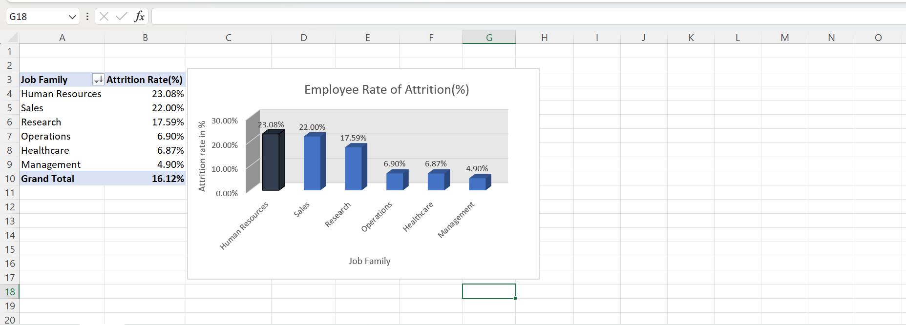
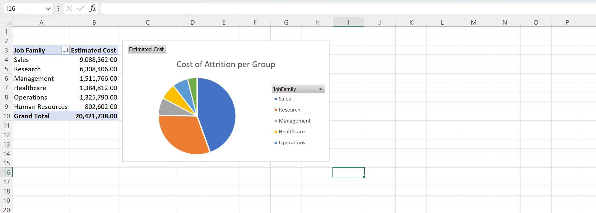

#### **Project Title :  HR Analytics Case Study: Employee Attrition Analysis**


#### **Project Overview :**

This project investigates the rate of employee attrition using HR data to identify department with highest turnover, estimate the financial impact of employee exits, and recommend data-driven retention strategies. The analysis combines Excel dashboards, SQL queries, Python analysis, and business reporting to support HR decision-making.

#### Business Problem

Employee attrition is a significant challenge for organizations because replacing experienced employees is costly and can reduce productivity. The HR department wanted to understand which departments, job roles, and salary groups experienced the highest turnover in order to prioritize retention initiatives and reduce replacement costs.

#### **Objectives :**

- Calculate the overall attrition rate using SQL, Python and Excel as data analysis tools.
- Identify departments with the highest attrition
- Analyze monthly income versus attrition
- Estimate replacement costs
- Recommend retention strategies

#### **Tools Used :**

| Tool | Purpose |
| --- | --- |
| Excel |  Dashboard creation, KPI reporting and data visualization |
| SQL |  Data extraction, aggregation and business analysis |
| Python(Pandas) | Data cleaning, transformation and validation |
| Pivot Tables | Data summarization |
| Pivot Charts | Visual Interaction |

#### Dashboard Preview :

<aside>

*Employee Attrition by Department*



*Estimated Cost of Attrition by Department*



</aside>

#### **Repository Structure :**

```markdown
## Repository Structure
Employee Attrition Analysis
Dashboard/
Dataset/
Images/
Python/
Reports/
SQL/

```

#### **Repository Contents :**

| File | Description |
| --- | --- |
| Excel Dashboard | Interactive dashboard |
| Analyst Brief | Executive summary and recommendations |
| Dataset | Source HR data |
| Images | Dashboard screenshots |
| SQL Scripts | Analysis queries |
| Python | Data preparation |

#### **Key Insights :**

- Overall rate of Attrition company wide is **16.12%.**
- Although Sales Representatives comprise only 20% of the  Job Family/Job Group, they account for 37% of all attrition within the Sales Job group/Family. This translates to approximately 33 employee exits, contributing 2.27 percentage points to the company's overall attrition rate of 16.12%, or roughly 14.1% of all employee departures company-wide.
- Lower monthly income bands experience higher rate of attrition.

## Business Impact

This analysis enables HR leadership to:

- Prioritize retention spending where it will have the greatest return.
- Identify departments requiring immediate intervention.
- Quantify the financial cost of employee turnover.
- Support evidence-based HR decision-making through interactive dashboards.

**Recommendations:**

From the data findings, the company should:

- Focus Company Retention Budget on Sales and Research Department.
Prioritize department-specific retention strategies before implementing company-wide initiatives. Since approximately **85% of employee attrition originated from just two of the six job groups**, targeted interventions are likely to deliver a greater return on investment than broad retention programs.
- Prioritize the Sales Representative role specifically, not the Sales department broadly — this single role, concentrated in the sub-$3K salary band, accounts for 37% of all Sales attrition while representing only 20% of Sales headcount. A targeted compensation review or retention incentive for this specific role/salary tier is likely to yield more measurable impact per dollar than a department-wide initiative.

---

**ABOUT ME**

I'm an aspiring Data Analyst building a portfolio of business-focused analytics projects using Excel, SQL, Python, Power BI, and workflow automation tools such as n8n.

I'm passionate about transforming raw data into actionable business insights and continuously improving my analytical skills through real-world case studies and automation projects.

#### Skills Demonstrated

- Data Cleaning        
- Exploratory Data Analysis
- Business Intelligence
- Dashboard Development
- SQL Reporting

- Python (Pandas)
- HR Analytics
- KPI Reporting
- Data Visualization
- Business Recommendation Development

---
